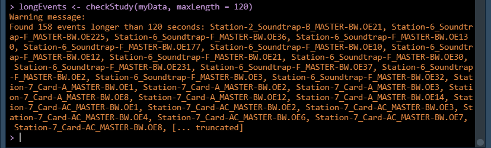
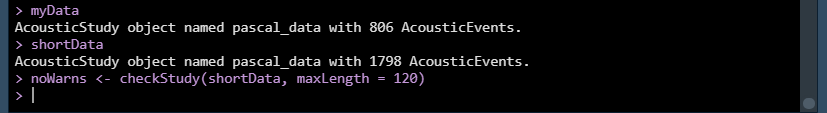

## Case Study: Splitting Events into Smaller Subsets

**Problem:** most of our events are from 2 minute long duty cycled
recordings, but some are from continuous recordings and are longer
than two minutes.

**Solution:** Let's split the longer events into smaller 2 minute events,
and we'll add on _1, _2, etc. to the event name for events we split up

First let's take a look at our problem. The `checkStudy` function checks for possible
errors in your event data. It is run automatically after you process your data, but we
can also use it on its own. Here we can have it check if any events are longer (in seconds)
than some maximum value we specify. This is useful if your data is from duty-cycled recordings,
since no events should be longer than your recording length.

```r
longEvents <- checkStudy(myData, maxLength = 120)
```
<a href="images/LongEvents.png" data-lightbox="long-events" data-title="Lots of events longer than two minutes"></a>

Looks like there are a lot, but this is because we know our dataset has a mix of duty-cycled and
continuous recordings. We want to be able to find these longer recordings and split them up
into a set of 2 minute long events instead of having one longer event. Our plan of attack is to
go through each event, find the start and end time of that event, and if that event is longer than
120 seconds break it up into a series of shorter events by using `PAMpal`'s `filter` function
to filter by `UTC`.

First let's write a couple helper functions that will make our code neater and easier to follow 
down the line. `getTimes` is going to take an `AcousticEvent` and just return all the detection
times (`UTC`). We'll also keep track of the `UID` just in case we need it.

```r
getTimes <- function(event) {
    # get all the detector data in this event
    allDets <- getDetectorData(event)
    # This goes through all of the $click, $whistle, and $cepstrum detectors if present
    justTimes <- bind_rows(lapply(allDets, function(x) {
        x[, c('UID', 'UTC')]
    }))
    justTimes
}
```

`timeToStartEnd` is going to take in a vector of `UTC` times (like from the output of
the `getTimes` function we just wrote) and turn it a list of start and end times for
our new shorter events. We start at the beginning of the event and just keep adding
120 seconds until we have passed the end of the event.

```r
timeToStartEnd <- function(time, length = 120) {
    range <- range(time)
    lenSecs <- as.numeric(difftime(range[2], range[1], units='secs'))
    # Figure out how many events of length "length" we can have
    numSplits <- ceiling(lenSecs / length)
    # Each event starts some multiple of length from the original start
    start <- range[1] + length * 0:(numSplits-1)
    # Doesnt matter that the end is different than the actual event end
    # here since we are just using these times to filter later
    end <- start + length
    list(start=start, end=end)
}
```

Now we're ready to create our new list of shorter events. Hopefully you can 
follow along with the comments in the code.

```r
# We're going to use a for loop, but first we're going to create
# a place to store our output for the new events
newEvents <- vector('list', length = length(events(myData)))
for(i in seq_along(newEvents)) {
    # One event at a time, use our functions from earlier to get the
    # start and end times for our neew times
    thisEvent <- events(myData)[[i]]
    thisTime <- getTimes(thisEvent)
    thisStartEnd <- timeToStartEnd(thisTime$UTC)
    # If it only made one start/end, we don't need to change anything!
    if(length(thisStartEnd$start) == 1) {
        # The "list" part might look weird, but its because when we are breaking
        # up events we are going to be storing list sof events in each "newEvents"
        # spot, and we'll plan on "unlisting" them at the end of this process
        newEvents[[i]] <- list(thisEvent)
        next
    } 
    # Make a place to store each smaller event
    evList <- vector('list', length = length(thisStartEnd$start))
    for(s in seq_along(thisStartEnd$start)) {
        # Create each smaller event by filtering the whole event
        # to detections only between the start/end times we created earlier
        onePart <- filter(thisEvent, UTC >= thisStartEnd$start[s],
                          UTC < thisStartEnd$end[s])
        # Theres a chance this resulted in no detections, so if that happens
        # just skip to the next one
        if(is.null(onePart)) next
        # We need to assign this a new event ID or we'll have a bunch of repeats
        id(onePart) <- paste0(id(onePart), '_', s)
        evList[[s]] <- onePart
    }
    newEvents[[i]] <- evList
}
# Now that we are done, unlist everything so that we have a big list of
# AcousticEvents, we'll stick those into an AcousticStudy that's a copy
# of our original so we can compare our results
newEvents <- unlist(newEvents)
names(newEvents) <- sapply(newEvents, id)
shortData <- myData
events(shortData) <- newEvents
```

Done! Let's compare our new `AcousticStudy` to what we started with to see what changed.

```r
myData
shortData
noWarns <- checkStudy(shortData, maxLength = 120)
```

<a href="images/NoLongEvents.png" data-lightbox="no-long-events" data-title="No more warnings!"></a>

No more warnings! All our events are now under two minutes, and we've got over
twice as many.
