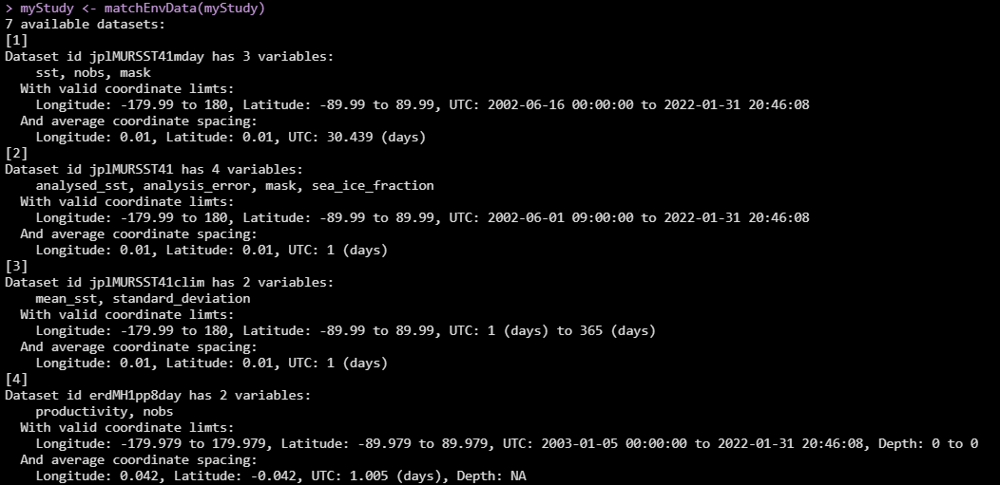
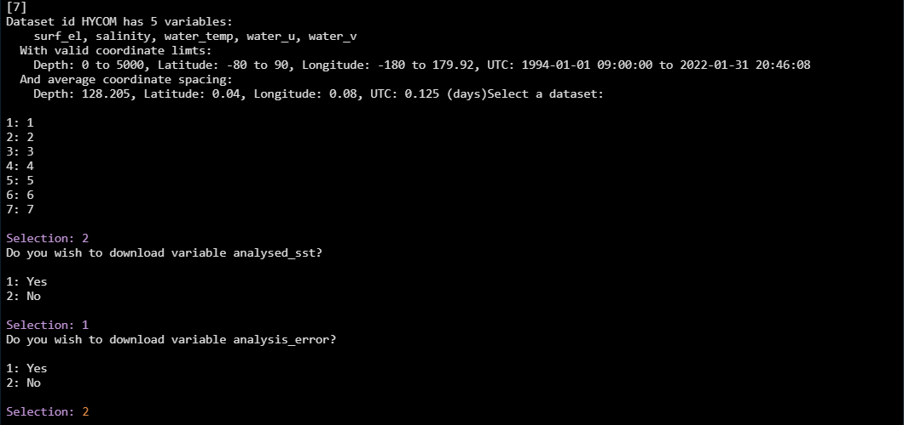

# Next Processing Steps

## Assigning Species IDs

PAMpal supports a variety of ways to assign species identifications to
specific `AcousticEvent` objects. These IDs can then be used for
[filtering data](#filtering-data) or potentially exporting to [create a
BANTER model](#exporting-for-banter-model). Species assignment is always
done using the `setSpecies` function, and has three possible modes of
operation that can be selected using the `method` argument.

For `method='pamguard'`, species IDs will be assigned according to the
labels set in Pamguard for each event. This will only work for
`AcousticStudy` objects created by `processPgDetections` using
`mode='db'`. For events created using the Click Detector module (these
have prefix OE in PAMpal), species IDs will be taken from the
"eventType" column in the Pamguard database. For events created using
the Detection Group Localiser module, the column used for species ID can
be more variable since users may define custom forms in Pamguard. PAMpal
will check for a species column in this order: 1) "Text_Annotation", 2)
a column with "species" in the name, 3) a column with "label" in the
name, 4) a column with "id" in the name. If none of these are present,
the first non-standard Detection Group Localiser column will be used for
species ID. Alternatively, users may provide an optional `label`
argument to `processPgDetections` to specify the name of a column in the
event table to use for species ID (ex.
`procesPgDetections(pps, mode='db', label='SpeciesCode1')`).

```r
myStudy <- setSpecies(myStudy, method='pamguard')
# Use this to examine species IDs easily
species(myStudy)
```

For `method='manual'`, species IDs will be assigned according to values
provided with the `value` argument. If `value` is a single value, all
events will be assigned this species ID. If `value` is a vector of
length equal to the number of events present, species IDs will be
assigned in the order they appear. Rather than relying on the order of
events, `value` can also be a dataframe with columns `event` and
`species` in which case species IDs will be assigned by name. Note that
event names in PAMpal typically include the database name as well as the
prefix OE or DGL, so it is usually best to get the list of full event
names with `names(events(myStudy))` when using this method. Note that it
is not required to assign an ID for all events present when `value` is a
dataframe, but if assigning species IDs to only a subset of events
PAMpal will issue a light warning message.

```r
# Set all species to "Pm"
myStudy <- setSpecies(myStudy, method='manual', value='Pm')
species(myStudy)
# Set species by order - typically not recommended, length must match number of events
myStudy <- setSpecies(myStudy, method='manual', value=c('PmCoda', 'PmRegular', 'Oo', 'Oo'))
# Set by dataframe
myStudy <- setSpecies(myStudy, method='manual',
                      value = data.frame(event = c('Example.OE1', 'Example.OE2', 'Example.OE3', 'Example.OE4'),
                                         species = c('Pm', 'Pm', 'Oo', 'Oo')))
```

For `method='reassign'`, species IDs will be reassigned from existing
values. This can be useful to switch from abbreviations to full
scientific names, or to change subgroups of species IDs to a single
group (e.g. maybe you used "PmCoda" and "PmRegular" in your original
analysis to differentiate between kinds of sperm whale detections, but
these would more appropriately just be "Pm" for a different analysis).
Reassignment is accomplished by providing `value` as a dataframe with
columns `old` and `new` specifying the desired conversions.

```r
# Expand Oo to Orcinus orca
myStudy <- setSpecies(myStudy, method='reassign', value = data.frame(old='Oo', new='Orcinus orca'))
# Change PmCoda and PmRegular to Pm
myStudy <- setSpecies(myStudy, method='reassign', 
                      value = data.frame(old = c('PmCoda', 'PmRegular'),
                                         new = c('Pm', 'Pm')))
```

As a last note, `setSpecies` also has an argument `type` to specify the
kind of species ID to assign. In almost all cases this does not need to
be changed from the default of `type='id'`, since this is the species ID
that PAMpal uses internally to determine the species of an event for
things like [filtering](#filtering-data). However, it can be useful to
specify other values for different types of species classification,
possibly visual vs. acoustic, or a classification coming from a
predictive model.

## Adding GPS Data {#gps}

PAMpal can add GPS data to all of your detections, matching the GPS
coordinates with the closest time (up to a maximum threshold to prevent
strangeness) to each detection in your `AcousticStudy`. These Latitude
and Longitude coordinates can then be used for
[filtering](#filtering-data) or to [download environmental
data](#adding-environmental-data).

This is easiest to do if GPS data is already present in the "gpsData"
table of the Pamguard database used to process your data, in which case
you need only call the `addGps` function, optionally changing the
`threshold` value from the default of 3600 seconds. Detections will be
matched with the GPS coordinate with the closest time, unless the time
difference between detection and GPS is larger than the `threshold`
value, in which case Latitude and Longitude will be set to `NA`. If GPS
data is not present in the Pamguard database, it can also be provided as
a dataframe with argument `gps`. This must be a dataframe or data.table
with columns UTC, Latitude, and Longitude, with UTC being converted to
POSIXct format. If providing GPS data this way, it can often be more
convenient to first add the GPS data directly to the Pamguard database
using the `addPgGps` function from the `PAMmisc` package, and then run
`addGps` as normal. `PAMmisc::addPgGps` has the advantage of being able
to handle multiple input formats (CSV, SPOT .gpx files) and account for
different data in different timezones, and once the GPS data is in the
database there is one less file you need to keep track of. After running
`addGps`, all GPS data will also be stored in the `gps` slot of your
`AcousticStudy`, which can be accessed with the `gps()` function.

```r
# If GPS is already in Pamguard databases you used to process, changing threshold to 30 minutes
myStudy <- addGps(myStudy, threshold=1800)
# Provide a dataframe of coordinates
myStudy <- addGps(myStudy, gps=gpsDataframe)
head(gps(myStudy))
```

## Gathering Detection Data in a Dataframe

The `AcousticStudy` and `AcousticEvent` classes that `PAMpal` creates
can be awkward to work with if you need to do something that doesn't
have a built-in function. In order to get your data into a format that
is easier to work with, `PAMpal` has functions that will gather your
data into dataframes.

The function `getDetectorData` takes as input either an entire
`AcousticStudy` or a single `AcousticEvent`, and gathers all the
detector data contained within into separate dataframes for clicks,
whistles, and cepstrum data. It returns a list of dataframes, named by
these detector types. Each dataframe within that list will contain all
the parameters calculated by the processing functions, as well as the
event ID, detector name, and the species ID ( species will be NA if it
has not been set using `setSpecies`). In addition to `getDetectorData`,
there are also three functions that do the exact same thing to get data
for only specific detectors, `getClickData`, `getWhistleData`, and
`getCepstrumData`. These have the exact same functionality, and are just
convenient to directly output a dataframe instead of needing to access
it from a list.

```r
# Get data for your entire study
allDets <- getDetectorData(myStudy)
# this will contain $click, $whistle, and $cepstrum (if those are present in your data)
names(allDets)
# To get the actual dataframe, get it out of the list first
str(allDets$click)
str(allDets$whistle)
str(allDets$cepstrum)

# The functions for accessing just one type of detector directly
justClicks <- getClickData(myStudy)
str(justClicks)
identical(justClicks, allDets$click)
justWhistles <- getWhistleData(myStudy)
justCepstrums <- getCepstrumData(myStudy)

# These also works for a single event
oneDets <- getDetectorData(myStudy$`Example.OE1`)
oneDets <- getDetectorData(myStudy[[1]])
oneClick <- getClickData(myStudy[[1]])
```

## Calculating Inter-Click Interval (ICI)

`PAMpal` has a built in function for calculating the inter-click
interval of your data since this is a common step for a lot of analyses.
The calculation is done by simply sorting all the detections by time,
and then for each detection taking the difference in seconds between it
and the previous detection. Then from these values the most common
number is selected as the ICI value (it is slightly more complicated
than this because the individual time differences are likely to be all
slightly different values, but this is the idea).

The function is called `calculateICI`, and is very straight forward.
There is only really one option to set, this controls what number to use
as the time of each detection. `time='time'` simply uses UTC time in
Pamguard

```r
myStudy <- calculateICI(myStudy, time='time')
```

`time='peakTime'` adjusts this slightly by using the time of the highest
value in the waveform clip. So if the peak value of the waveform for a
given detection is 500 samples into a clip, then 'peakTime' will use the
UTC time plus 500 / SampleRate as the time of that click

```r
myStudy <- calculateICI(myStudy, time='peakTime')
```

This calculation is done for every event, and is done separately for
each click detector in the event (note that `PAMpal` splits click
detections up by click classification number, so you have
Click_Detector_0, Click_Detector_1, etc.), and also calculated combining
all the detectors in an event. These data are stored within the
`ancillary` slot of each event which can be accessed using the
`ancillary()` function, but the easiest way to get the data back out is
using the `getICI` function. This has one parameter, selecting the type
of data you want to get. `type='value'` will return the single ICI value
calculated for each detector as a list named by detector name.

```r
iciValues <- getICI(myStudy, type='value')
```

This returns a list of results for every single event, so to see the ICI
values for your first event:

```r
iciValues[[1]]
```

`type='data'` will return all the individual time differences used to
calculate the number returned by 'value', this can be useful for making
plots or if you have your own way of doing things

```r
iciData <- getICI(myStudy, type='data')
```

These are similarly returned as a list for each event, and the result is
a list of dataframes for each click detector that just contain the name
of the detector and the time difference values used

```r
str(iciData[[1]])
```

Looking at the actual numbers for the ICI data that combines all the
detectors, the first value will always be 0 since there is no time
between the first detection and the previous detection. It can also
appear that the ICI values are repeated, especially for `time = 'time'`,
but this is because the time difference calculations are done separately
for each channel. In fact for `time = 'time'` the values across channels
will be exactly the same since Pamguard does not store a separate
detection time for each channel, but the ICI values should be close but
slightly different for `time ='peakTime'`

```r
iciData[[1]]$All
```

## Calculate and Plot Average Click Spectra

This is an in-depth topic that has its [own page][avg-spec]

## Adding Environmental Data {#adding-environmental-data}

Trying to download and match up environmental data to your
acoustic data can be quite a pain, but lucky for you PAMpal is
here to make it easier. This currently works with data from ERDDAP
or HYCOM dataservers, or from a netcdf file that you already have.
Adding environmental data requires that you 
have first added [GPS coordinates](#gps). From there you just need
to use the function `matchEnvData`, which has a lot of options ranging
from very simple to more involved. 

#### Download from Dataset List

The simplest way to use this function is by giving it no information other
than your `AcousticStudy` object. In this case it will bring up a menu of
some dataset suggestions to get you started:

<a href="images/EnvMenu.png" data-lightbox="env-menu" data-title="Selecting environmental dataset"></a>

Each dataset has an ID (this is usually the exact ERDDAP ID, which may not
be particularly informative), a list of variable names (also exactly matching
the names as stored in the data structure, may not be informative), the
range of valid coordinates (pay particular attention to time range if you are
working with older data), and the average spacing of the coordinates (note
the jplMURSST dataset has three flavors with different time spacing - daily,
monthly, and averaged climatology).

Choose which one you want by entering the appropriate number, then you will
be asked which of the variables you want to download. Here we download the
daily MURSST data (#2), and then choose to download only the `analysed_sst` 
variable, selecting "No" `analysis_error`, `mask`, and `sea_ice_fraction`.

<a href="images/EnvVarSelect.png" data-lightbox="env-varselect" data-title="Selecting variables to download"></a>

After making decisions for all the variables, the data will start to 
try and download, and you will see a progress bar. If the temporal and phyiscal
range of your dataset is small, this can be quite quick, but for larger datasets
it might take some time. PAMpal tries to break up larger downloads into smaller
individual chunks since most servers have limits on file size. Note that
download from HYCOM servers usually involve longer delays.

#### What Did We Download?

So, what does this function actually do? For each `AcousticEvent` in your 
`AcousticStudy`, `matchEnvData` will get the environmental data closest
to the coordinate associated with the *start* of that event. This means 
that each event will have a single piece of environmental data associated with
it, rather than a separate value for every single detection within that event.
This is because environmental variables typically change on a much larger scale
than individual detections within an event, but if you have exceptionally long
events this might not be the most accurate (there are other options you may
try further below).

**NOTE** Currently (01/31/2022) if your environmental dataset has a Depth
component, `matchEnvData` will average the value over all available depths.
This will be expanded in future versions in Q1 2022

To see the data, you can use the `getMeasures` function. The `measures` are
special values stored for each event so that `PAMpal` knows to export
them for modeling applications, so you might also see the ICI or some
other things here depending on what other processing you have done. The measures
will also be attached to your detections when using the `getDetectorData`
family of functions (as of `PAMpal` v0.15.2, not yet on CRAN as of 01/30/2022
only on GitHub). You'll also note that each variable name has `_mean` appended
to the end, more on this towards the end of this section.

```r
# You should see the downloaded values here for each event
getMeasures(myStudy)
# This should have a new column for the environmental data
str(getClickData(myStudy))
```

#### Download Other ERDDAP Datasets

If you have a different ERDDAP dataset in mind, PAMpal can also work with that.
If the dataset is on the [upwell][https://upwell.pfeg.noaa.gov/erddap/index.html]
server, then you can just provide the dataset id as the `nc` argument, and then
it will ask which variables you want as before:

```r
myStudy <- matchEnvData(myStudy, nc='erdMWpar01day')
```

If it is on a different server, there is slightly more set-up involved,
and you may need to manually load the `PAMmisc` package for the rest to work.
You will need to set up an `edinfo` object using the function `erddapToEdinfo`.
This object contains all the info needed to create the server request that lets
`PAMpal` sort out the downloading process for you. Here we'll create one for
this [distance to shore](https://pae-paha.pacioos.hawaii.edu/erddap/griddap/dist2coast_1deg.html) dataset stored on a different ERDDAP server. We need to tell it the
dataset ID and the URL of the dataserver. It will then ask which variables you
want to download, as before.

```r
library(PAMmisc)
# dataset is the dataset ID
# baseurl is the rest of the URL, up to /erddap/
dist2shore <- erddapToEdinfo(dataset='dist2coast_1deg'
                             baseurl='https://pae-paha.pacioos.hawaii.edu/erddap/')
# Then use this as the "nc" argument
myStudy <- matchEnvData(myStudy, nc=dist2shore)
```

#### Download Without Interactive Steps

While PAMpal's interactive features can be useful when doing an
exploratory analysis, or for one-off analyses, it can be a hassle
for any analysis that might get run multiple times. Getting environmental
data without any interactive steps just requires slightly more setup.
This may require directly loading the `PAMmisc`, then we create an `edinfo`
object as above. This time we use the option `chooseVars = FALSE` to
avoid the interactive menu, then use the function `varSelect` to manually
set the variables we wish to download. This requires knowing how many
total variables there are in your dataset, since the number of values given
to `varSelect` must match the number of variables present.

```r
# This dataset is on upwell, we'll select only the first of 4 variables
sst <- erddapToEdinfo(dataset='jplMURSST41',
                      chooseVars = FALSE)
sst <- varSelect(sst, select=c(TRUE, FALSE, FALSE, FALSE))
# this dataset is on a different server, it has a single variable that we will get
dist2shore <- erddapToEdinfo(dataset='dist2coast_1deg',
                             baseurl='https://pae-paha.pacioos.hawaii.edu/erddap/',
                             chooseVars = FALSE)
dist2shore <- varSelect(dist2shore, select = c(TRUE))
myStudy <- matchEnvData(myStudy, nc=dist2shore)
```

#### Saving the Downloaded File

If you need to re-use the same environmental dataset for multiple
analyses, you might be able to save the file and use it instead of
downloading the same dataset multiple times. Just setting the
`fileName` argument will have `PAMpal` save the downloaded Netcdf
file. However, there are situations where this doesn't work. If
your dataset covers a large range of times or locations, the file
size required to download that all in a single file might be too large.
The dataservers typically have restrictions on how large of a file they can
serve, and if this happens this download will fail. Even if it doesn't
fail, it might take quite a long time. When not saving the downloaded file,
`PAMpal` can get around this issue by breaking down the request into
several smaller downloads, so if you are not able to save the Netcdf file 
then this is always an option.

```r
# Save our distance to shore data for future use
myStudy <- matchEnvData(myStudy, nc=dist2shore, fileName='Dist2Shore.nc')
```

#### Loading From an Existing Netcdf File

If you were able to download your data as above, how can you actually use it?
Easy! Just set the `nc` argument to that filename, and `PAMpal` will load
in all the variables stored in that Netcdf file. Unlike when downloading,
it will not ask which variables you are interested in, it will just take 
everything that is available. One potential issue here - Netcdf files do
not have universal standards for how coordinates are stored, so it is possible
that if you have a Netcdf file from somewhere else that it might not be
able to read it properly. This is typically an issue with how the date/time
information is stored - `PAMpal` can currently handle most of the formats
found on ERDDAP, but if you encounter a problem here please reach out and
I will get it fixed for you!

```r
# Use the data we stored in the step above
myStudy <- matchEnvData(myStudy, nc='Dist2Shore.nc')
```

#### Summarising Environmental Variables Over a Range

Sometimes it can be useful to summarise environmental variables over a
range of values instead of just picking the closest value. To support
this, there is a `buffer` argument that can be used to set a range of 
values to summarise over. This is a vector of length 3 specifying how 
much to expand the Longitude, Latitude, and Time values in each direction 
(units of decimal degrees and seconds). For example if our point was at
32, -117:

```r
# All values between Lat 30,34 and Long -118,-116
myStudy <- matchEnvData(myStudy, 'jplMURSST41', buffer = c(1, 2, 0))
# Average all times within one day
myStudy <- matchEnvData(myStudy, 'jplMURSST41', buffer = c(0, 0, 86400))
```

How are they summarised? By default, all values within the `buffer` range
are averaged, but if you want to do something else like the median or
come up with some other way to summarise you can provide these as a 
vector `FUN`. Each function creates another stored variable for each
environmental variable as `EnvVariableName_FunctionName`

```r
# Compute standard deviation as well as default mean
# Stored vars "analysedsst_mean" and "analysedsst_sd"
myStudy <- matchEnvData(myStudy, 'jplMURSST41', 
                        buffer = c(1, 1, 0), FUN=c(mean, sd))
# Replace mean with median
# Stored var "analysedsst_median"
myStudy <- matchEnvData(myStudy, 'jplMURSST41', 
                        buffer = c(1, 1, 0), FUN=c(median))
```

If you write your own summarising function,
just provide the name of that to `FUN`. These functions should
expect a matrix of values, and should expect the possiblity of 
`NA` values.

#### More Options for Dataframes

All of the above methods can work on dataframes instead of 
`AcousticStudy` objects, in which case every single row of the
dataframe will get its own matching environmental data. This can
be useful if you have exceptionally long events, you can extract
a dataframe of your detections using the `getDetectorData` family
of functions and then match environmental data to it.

```r
library(PAMmisc)
clicks <- getClickDat(myStudy)
clicks <- matchEnvData(clicks, 'jplMURSST41')
```

You will notice that when matching to a dataframe there are a lot
more columns attached. In additional to the normal variable names,
there are columns for `matchLat`, `matchLong`, and `matchTime`. The 
Netcdf files have fixed datapoints, so these tell you the coordinate
within the Netcdf file that your data matched to. This can be useful
to double check and make sure that matches were made appropriately, or
in cases where your Netcdf file did not fully cover the range of your data.
These columns can be removed from your output by setting `keepMatch = FALSE`

## Filtering Data {#filtering-data}

AcousticStudy objects can be filtered with syntax similar to the `dplyr`
package using the function `filter`. There are currently five ways data
can be filtered: by database, species, environmental data values,
detector name, and function parameter values.

Filtering by database leaves only events with databases in
`files(event)$db` matching the criteria provided, but database names
must exactly match the full file path to the database. Criteria are
specified using either `database` or `Database`, the best way to provide
the full names is typically by indexing from `files(myStudy)$db`.
Alternatively, functions like `basename` can be used

```r
# This won't work because it needs the full file name and path
oneDb <- filter(myStudy, database == 'FirstDb.sqlite3')
# This works instead, events from only first database
oneDb <- filter(myStudy, database == files(myStudy)$db[1])
# This also works
oneDb <- filter(myStudy, basename(database) == 'FirstDb.sqlite3')
# Events from all databases other than first
notFirstDb <- filter(myStudy, database != files(myStudy)$db[1])
# To specify multiple, use %in%
# Events with first two dbs only
twoDb <- filter(myStudy, database %in% files(myStudy)$db[1:2])
# Events from all dbs other than first two
notTwoDb <- filter(myStudy, !(database %in% files(myStudy)$db[1:2]))
```

Filtering by species leaves only events matching the species criteria
provided, and thus should only be done after species are assigned using
`setSpecies`. Criteria are specified using either `species` or
`Species`.

```r
# Only 'ZC' events
zcOnly <- filter(myStudy, species == 'ZC')
# Not ZC events
notZc <- filter(myStudy, species != 'ZC')
# To specify multiple species, use %in%
ZCGG <- filter(myStudy, species %in% c('ZC', 'GG'))
notZCGG <- filter(myStudy, !(species %in% c('ZC', 'GG')))
```

Filtering by environmental data leaves only events matching the criteria
provided, and the names of the criteria must exactly match the names of
variables listed in `ancillary(myStudy[[1]])$environmental`, so it is
usually best to double check these names before filtering.

```r
# This probably wont work because name is not exact match
shallowOnly <- filter(myStudy, sea_floor_depth > -500)
# Environmental parameters usually have mean or median added to the name, this works
shallowOnly <- filter(myStudy, sea_floor_depth_mean > -500)
```

Filtering by detector name leaves only detections from detectors
matching the criteria provided, and the names of the criteria must
exactly match the names of detectors. Note that Click Detectors
typically have a number appended to their name, and all detectors use
underscores instead of spaces. Note that these also take their names
from the names given in Pamguard, which may not always be the default.
It is best to check exact names using `names(detectors(myStudy[[1]]))`
before filtering. Any events left with no detections will be removed
from the study.

```r
# Remove Click_Detector_0
noZero <- filter(myStudy, detector != 'Click_Detector_0')
# Just 1 or 2
justOneTwo <- filter(myStudy, detector %in% c('Click_Detector_1', 'Click_Detector_2'))
```

Filtering by function parameters works slightly differently than the
above four methods. The interface is the same, but instead of removing
entire events it will remove all detections that do not match the
criteria supplied. Parameter names must exactly match the names of
parameters calculated by some of the processing functions. If a name
provided does not match the name of a parameter in a detector, then all
of that data will remain unfiltered. For example, `trough` is a value
measured by `standardClickCalcs`, so filtering by `trough > 10` will
affect all click detections in your data, but will leave all Whistle or
Cepstrum detectors untouched. Any events that are left with 0 detections
after filtering are removed.

```r
less10Peak <- filter(myStudy, peak < 10)
peak10to20 <- filter(myStudy, peak > 10, peak < 20)
```

Multiple types of filters can also be combined into a single filter
statement

```r
filterStudy <- filter(myStudy,
                        database != files(myStudy)$db[3],
                        species == 'OO',
                        sea_floor_depth_mean < -1000,
                        peak > 15)
```

If you want to filter out specific events by event id / event name, that
is actually easiest to accomplish without using the filter function at
all, but rather just using `[]` to subset your data. You can provide
either indexes or full event names, event names are usually easiest to
provide by indexing into `names(events(myStudy))`

```r
firstOnly <- myStudy[1]
someOdds <- myStudy[c(1,3,5,7,9)]
byName <- myStudy[names(events(myStudy))[c(1,3,5)]]
```

**KNOWN ISSUES WITH FILTERING**

Currently there are two known issues with the `filter` function as
implemented. First, if you supply a long list of options for a single
filter, it won't work and will likely give you an error. As a
workaround, the function works fine if you first assign these to a
variable, then filter.

```r
# This probably won't work
badFilt <- filter(myStudy, species %in% c("SPECIES1", "SPECIES2", "SPECIES3", "SPECIES4", "SPECIES5",
                             "SPECIES6", "SPECIES7", "SPECIES8", "SPECIES9", "SPECIES10"))
# This should be fine
mySpecies <- c("SPECIES1", "SPECIES2", "SPECIES3", "SPECIES4", "SPECIES5",
                "SPECIES6", "SPECIES7", "SPECIES8", "SPECIES9", "SPECIES10")
goodFilt <- filter(myStudy, species %in% mySpecies)
```

Second, the `filter` function currently does not behave well if you try
to use it inside other functions. Unfortunately there is not currently a
work around for this, but I will be looking into improving the function
in the filter so that these issues do not occur.

```r
# This probably won't work
myFilter <- function(x, sp) {
    filter(x, species %in% sp)
}
# running this will give an error about "object 'sp' not found"
myFilter(myStudy, 'SPECIES1')
```

## Accessing Binary Data

Sometimes it can be useful to access the binary data that PAMpal uses
when initially processing data, especially if you need access to the
wave forms of click detections. PAMpal has a function `getBinaryData`
that makes this easy. You just need to provide the UIDs of detections
that you would like binary data for, and the binary data for each will
be returned in a list. There are occasionally instances where UIDs can
be repeated across different types of detectors, so there is also a
`type` argument that you can use to specify whether you are looking for
binaries from clicks, whistles, or cepstrum detections, although this is
usually not needed. Typically the easiest way to get UIDs without
copying/pasting is with `getDetectorData` or the similar functions
`getClickData`, `getWhistleData`, and `getCepstrumData`.

```r
# Get the UIDs first to make things easier, then get click binary data
clickUIDs <- getClickData(myStudy)$UID
# These are usually identical, but occasionally it is necessary to specify type
binData <- getBinaryData(myStudy, UID=clickUIDs)
binData <- getBinaryData(myStudy, UID=clickUIDs, type='click')
# plot the waveform of the first click
plot(binData[[1]]$wave[, 1], type='l')
```

## Exporting for BANTER Model {#exporting-for-banter-model}

If you've ever tried to run a model created by someone else on your own
data, you probably know that just getting your data formatted properly
can be a huge challenge. One of our goals with PAMpal is to reduce that
headache by creating export functions that will organize your data into
the format required by various models. Currently we only support
exporting data for creating BANTER models (see: package `banter`
available on CRAN, [BANTER paper](https://doi.org/10.1111/mms.12381),
[BANTER guide][banter-guide]). In the future we
hope to add support for a variety of models, feel free to e-mail me at
[taiki.sakai\@noaa.gov](mailto:taiki.sakai@noaa.gov) if you have a model
that you would like to have supported.

Exporting data in your AcousticStudy object is as easy as calling
`export_banter`. The output is a list with `events`, `detectors`, and
`na`. The contents of `events` and `detectors` are formatted for
`banter::initBanterModel` and `banter::addBanterDetector`, respectively,
and `na` is a dataframe showing the information for any detections that
had NA values (these will be removed from the exported data since random
forest models cannot deal with NAs). Also note that BANTER can use
event-level information in addition to information about each detection.
Of PAMpal's provided functionality, currently only `calculateICI` and
`matchEnvData` will add this kind of event-level information to your
AcousticStudy object, but in general anything that is in the list named
`measures` in the `ancillary` slot of each event can potentially be
exported for modeling purpose (you can see this for your first event
with `ancillary(myStudy[[1]])$measures`. Only event-level measures that
exist for all exported events can be used in a BANTER model,
`export_banter` will issue a warning message if there are event-level
measures found that are not present in all events.

```r
# Assign species labels before exporting so that data can be used to train a model
myStudy <- setSpecies(myStudy, method='pamguard')
banterData <- export_banter(myStudy)
names(bnt)
# create model using exported data.
banterModel <- banter::initBanterModel(banterData$events)
banterModel <- banter::addBanterDetector(banterModel, banterData$detectors, ntree=50, sampsize=1)
banterModel <- banter::runBanterModel(banterModel, ntree=50, sampsize=1)

# add ICI data for export
myStudy <- calculateICI(myStudy)
# This may issue a warning about event-level measures depending on your data
banterICI <- export_banter(myStudy)
```

`export_banter` will issue warning messages if any of the species or
detectors have an insufficient number of events (see [BANTER
documentation](banter-paper) for more information about requirements for
creating a model), and it will also print out a summary of the number of
detections and events for each species after running (this can be turned
off with `verbose=FALSE`). There are also two parameters that will allow
you to easily remove a subset of species or variables from the exported
data, `dropVars` and `dropSpecies`. Both take in a character vector of
the names of the variables or species that you do not want to be
exported.

```r
# dont include peak3 or dBPP in the exported variables
lessBanter <- export_banter(myStudy, dropVars = c('peak3', 'dBPP'))
# dont include species Unid Dolphin or Unid BW in exported
noUnids <- export_banter(myStudy, dropSpecies = c('Unid Dolphin', 'Unid BW'))
```

Finally, `export_banter` also has a logical flag `training` to indicate
whether or not the data you are exporting is to be used for training a
new BANTER model. If `training=TRUE` (the default), then species IDs are
required for each event, but if it is `FALSE` then they are not
required. Additionally, if `training` is a numerical value between 0 and
1, then the exported data will be split into `$train` and `$test`
datasets, where the value of `training` indicates the proportion of data
to use for a training dataset, with the rest being left in `$test`. Note
that splitting your data into training and test sets is not actually
needed for BANTER since it is based on a random forest model (ask Eric
Archer if you need convincing), but the option is included since it is
frequently asked for.

```r
trainTest <- export_banter(myStudy, train=0.7)
names(trainTest)
nrow(trainTest$train$events)
nrow(trainTest$test$events)
```

[avg-spec]: AvgSpec.html
[banter-guide]: banterGuide.html
