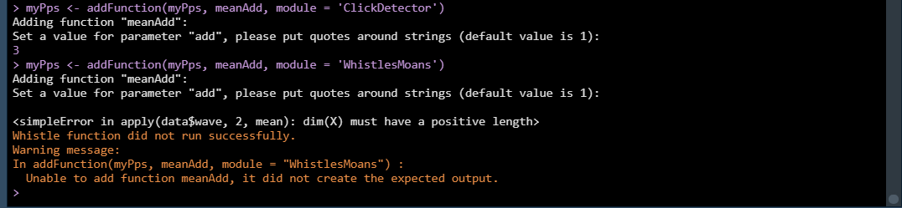
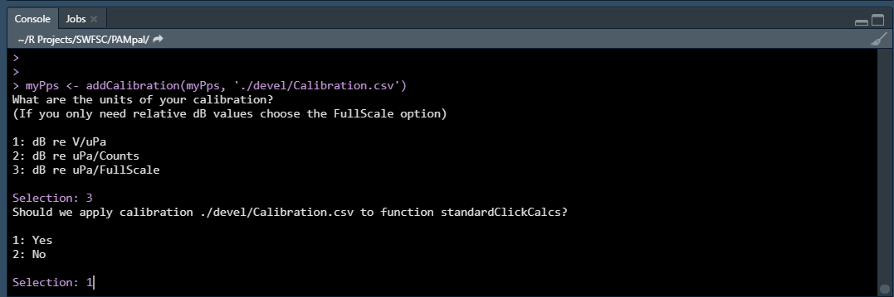
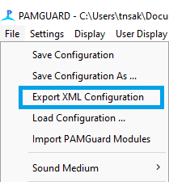
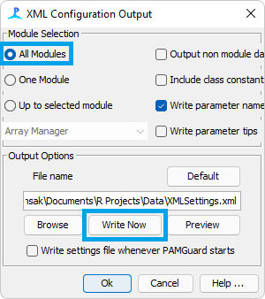

## The PAMpalSettings object

The first step in using PAMpal is to create a PAMpalSettings object. This is an
S4 class created for this package, and will store all settings related to a
particular anaylsis. The goal of this object is to make it easy to share and
replicate results between users. All you need to do is send someone your
PAMpalSettings object and they can see exactly how you analysed your data, or 
even point the PPS at their own data and process it in the exact same way.

A PAMpalSettings object has five slots:

* db - This stores the full path to any SQLite databases that will be analysed
* binaries - This stores the folder names of any binaries, as well as the full
path to all individual Pamguard binary (.pgdf) files within those folders
* functions - This stores a set of functions that will be applied to the data 
when read in from the database/binary files. Stores functions for the 
'ClickDetector', 'WhistlesMoans', and 'Cepstrum' modules separately. When adding a new 
function, users are asked to supply values for any arguments of the function.
These values are saved with the function and cannot be changed without removing
the function entirely. 
* calibration - Stores a calibration function to correct for different hydrophone
characteristics. Optional, currently only affects certain 'ClickDetector' functions.
Added with the function `addCalibration`
* settings - Stores an XML settings file created by Pamguard. This file is mostly
used to keep track of whether or not a decimator was used for various detectors,
but it also stores all of the settings used for all detectors. Optional, but 
recommended. Added with the function `addSettings`

Note that none of these slots should ever be manually edited, use the functions described
below if you want to add or remove anything.

### Creating a PPS Without Pop-Ups

A PAMpalSettings object can be created without supplying any arguments (as described in the
[quick start guide](README.md)), or it can be created by directly supplying the database and binary
file paths. You can also provide the parameter values for `standardClickCalcs` to avoid the
interactive menus entirely.

```r
myDb <- './Data/TestDB.sqlite3'
myBinaryFolder <- './Data/Binaries'
myPps <- PAMpalSettings(db = myDb, 
                        binaries = myBinaryFolder,
                        sr_hz = 'auto',
                        filterfrom_khz = 10,
                        filterto_khz = NULL,
                        winLen_sec = .001)
```

### Adding to Your PPS

After the initial set-up of your PPS, you may want to add to it. There are 
four functions that accomplish this: `addDatabase`, `addBinaries`,
`addFunction`, `addCalibration`, and `addSettings`. The first two are simple, and can be called interactively
just like the initial PPS setup or by providing the paths.

```r
myPps <- addDatabase(myPps)
myPps <- addBinaries(myPps)
newDb <- './Data/NewDB.sqlite3'
newBinaries <- './Data/NewBinaries/'
myPps <- addDatabase(myPps, newDb)
myPps <- addBinaries(myPps, newBinaries)
```

### Adding Functions

Adding a function is slightly more involved. First make sure the function (or
the package the function is in) is already sourced. Then add the function by
name, also specifying the module as either 'ClickDetector', 'WhistlesMoans',
or 'Cepstrum'.
If you do not specify, you will be asked to choose. `addFunction` will also
ask the user to set the value for any parameters that are arguments to the
function you provide, except for parameters named "data" or "calibration".
In the following example, the user would be ask to set a value for "add" and
would be told that the default for "add" is 1. You can also provide values for the
function arguments in the `addFunction()` call.

```r
meanAdd <- function(data, add=1) {
    result <- apply(data$wave, 2, mean) + add
    data.frame(MeanAdd = result)
}

myPps <- addFunction(myPps, 
                     meanAdd, 
                     module = 'ClickDetector') 
# This avoids the interactive pop-up asking to set the value of 'add'
myPps <- addFunction(myPps, 
                     meanAdd, 
                     module = 'ClickDetector', 
                     add = 2)
```

PAMpal does some checking when a new function is added to a PPS to ensure
that the functions have output that is in the proper format. This is to 
hopefully catch any potentials errors in this step rather than at the 
processing step. If we try to add this same function to the "WhistlesMoans"
module, it will trigger a warning from these checks and the function
will not be added. This happens because the `data` for the "WhistlesMoans"
module does not have a $`wave` portion like the "ClickDetector" data, so the
function does not work properly. See [here][custom-functions] for more information
on the requirements for adding functions other than the built-in functions.

<a href="images/FnAddError.png" data-lightbox="fn-add-error" data-title="Added function successfully to ClickDetector but not WhistlesMoans"></a>

You can also add functions during the initial call to `PAMpalSettings` by setting
the `functions` parameter. This needs to be a named list of the functions you want
to add, where the name is the module that you want to add the function for.

You can also do this in the initial call to `PAMpalSettings` by using the `settings`
parameter:

```r
myPps <- PAMpalSettings(db = myDb, 
                        binaries = myBinaryFolder,
                        sr_hz = 'auto',
                        filterfrom_khz = 10,
                        filterto_khz = NULL,
                        winLen_sec = .001,
                        functions = list('ClickDetector' = meanAdd),
                        add = 2)
```

Note that you can specify parameter values for your new function here as well. If
any of the functions you add share parameter names with any other functions, then
specifying the value here will use that same value for all functions that need it. 
For example, if our new `meanAdd` function had a parameter called `filterfrom_khz`
then it would have also been set to 10 in the example above. 

### Adding Calibration

A calibration file can be added that will adjust caluclated dB values, this currently
mostly affects calculations within `standardClickCalcs`. The calibration can be supplied
either as a CSV file or as a dataframe, and will need to have two columns, with the first 
being Frequency in Hz and the second being sensitivity in dB. 

```r
myPps <- addCalibration(myPps, 'Calibration.csv')
```

This will bring up menu selections asking what units the calibration are in (see
`?addCalibration` for more details) and which functions this calibration should apply
to.

<a href="images/Calibration.png" data-lightbox="add-calibration" data-title="Adding calibration to a PPS"></a>

### Adding XML Settings

It is a good idea to add an XML settings file exported from Pamguard. This helps
PAMpal keep track of which detectors are operating at which samplerate, which
is surprisingly tricky to keep track of otherwise. For example, there is no way
to tell just from the database whether or not a decimator was used, which is why
the `standardClickCalcs` function needs the `sr_hz` parameter to manually set this
value if it was run on decimated data.

The first step to adding settings is to get the settings file out of Pamguard in
the first place. This is found under File -> Export XML Configuration:

<a href="images/ExportXMLMenu.png" data-lightbox="xml-menu" data-title="Where to export XML"></a>

This will open a dialogue box with lots of options, but we only need a few of them.
First make sure that the "All Modules" box is checked. Then you can change the name
of the XML file that will be created (highly recommended, the default names can
be quite long). Finally you must actually hit the "Write Now" button rather than just
hitting "Ok".

<a href="images/ExportXMLOptions.png" data-lightbox="xml-options" data-title="Important options in XML dialogue box"></a>

This file is like an XML version of the .PSF files that Pamguard runs on - it stores
settings for all the modules you have added to Pamguard, but in a more portable format
that can be read by other programs. Now we need to add this XML file to our `PAMpalSettings`
object with the `addSettings` function

```r
myPps <- addSettings(myPps, 'XMLSettings.xml')
```

You can also do this in the initial call to `PAMpalSettings` by using the `settings`
parameter:

```r
myPps <- PAMpalSettings(db = myDb, 
                        binaries = myBinaryFolder,
                        sr_hz = 'auto',
                        filterfrom_khz = 10,
                        filterto_khz = NULL,
                        winLen_sec = .001,
                        settings = 'XMLSettings.xml')
```

Now when we run `processPgDetections` PAMpal will be assured of using the appropriate
sample rate for various detectors, and additionally the settings you had chosen for these
detectors will be stored in the `settings` slot of your `AcousticStudy` object.
This is a long messy list parameters that serves no purpose other than record keeping.
One example of potentially relevant information stored here is all of the settings
for the different classes if using the Click Classifier for click detections. Since
these classes are only labeled by a single number, storing the settings here allows
us to compare classes from datasets run by different people to ensure that the
settings for each class are the same.

### Adding from another PPS

A separate PAMpalSettings object can also be supplied as the source for any of the 
functions that add to your PPS. In this case everything from the corresponding
portion of the PPS will be added to the new PPS object.

```r
myPps <- addDatabase(myPps, otherPps)
myPps <- addBinaries(myPps, otherPps)
myPps <- addFunction(myPps, otherPps)
myPps <- addCalibration(myPps,otherPps)
```

### Removing Things From Your PPS

There are four functions that remove items from your PPS, and it is recommended
that you use this instead of trying to alter the PPS manually. All of them can
be called interactively and provide menus for the user to select the item to 
remove. See the help pages for more info.

```r
myPps <- removeDatabase(myPps)
myPps <- removeBinaries(myPps)
myPps <- removeFunction(myPps)
myPps <- removeCalibration(myPps)
```

[custom-functions]: CustomFunctions.md
