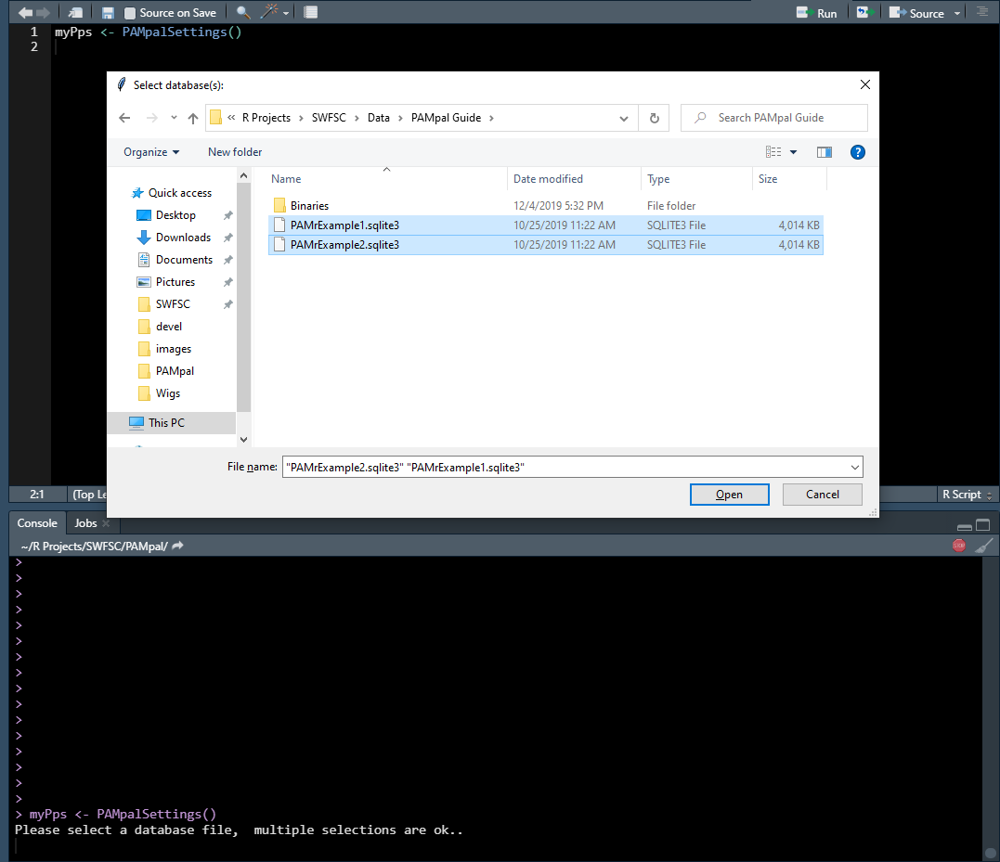
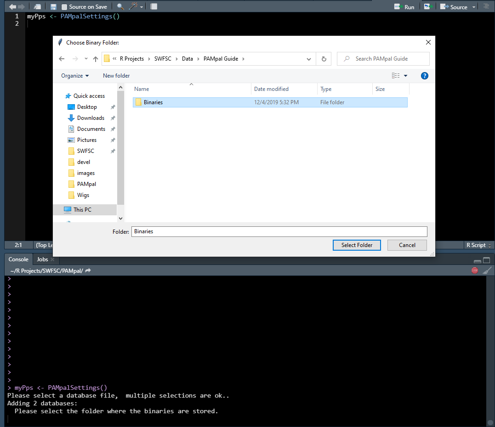
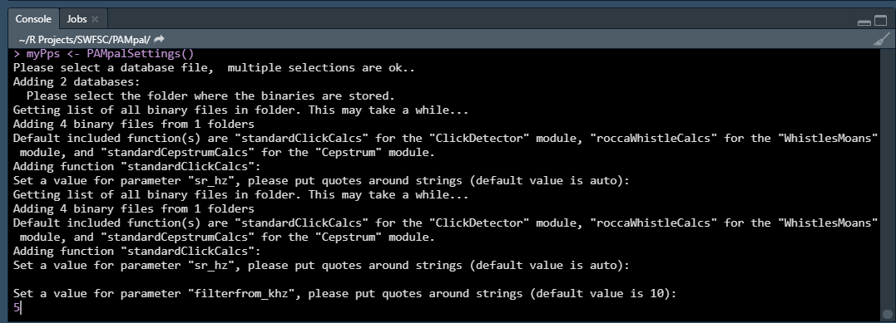
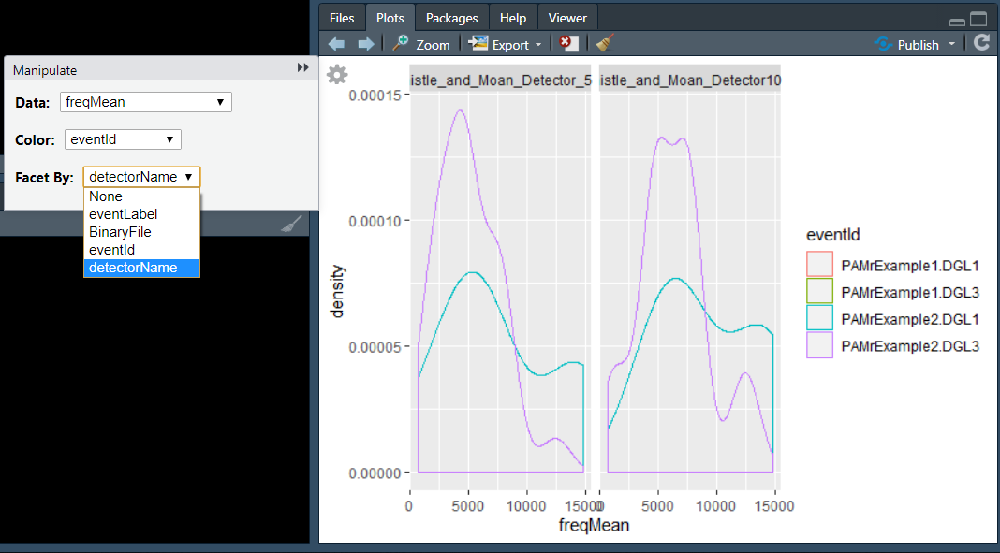

# PAMpal

This is a package for processing passive acoustic data. Currently only supports
data collected using [Pamguard][pamguard], but in the future
we hope to support other platforms. 

Note that this is currently a beta version, so some bugs and quirks are expected.
Hopefully this guide will work you through the most common pitfalls, but please
report any other issues to [taiki.sakai@noaa.gov](mailto:taiki.sakai@noaa.gov).

Our goal is to make your life easier, so if you have any other suggestions or 
feedback feel free to pass that along as well!

## Using This Guide

This document is meant to be a resource to help you get started with PAMpal 
for the first time, and then then the [Next Steps](#next-steps) section has
links with more in depth information and the more advanced capabilites of
PAMpal. This is also meant to be a complimentary
resource to the help files within R, so if you have questions about a specific
function you should first try `?function` and then look here if that
doesn't answer your question. Some images may have small text, you can click
on an image to open up a larger version.

## Installation

To install the latest version from GitHub, first make sure that you have
[Rtools](https://cran.r-project.org/bin/windows/Rtools/) installed, then 
run the following code to install PAMpal.

```r
# make sure you have Rtools installed
if(!require('devtools')) install.packages('devtools')
# install from GitHub
devtools::install_github('TaikiSan21/PAMpal')
```

### Common Installation Issues

* If you are getting errors related to `Unable to unload package 'ProblemPackage'`, try
opening a fresh R session, or installing the package from the R console instead
of RStudio. Sometimes R can have troubles updating package that are currently in use.

* If you see an error like `Error in strptime(xx, f, tz = tz) : unable to identify current timezone 'C'`,
then run the code `Sys.setenv(TZ = 'UTC')` and try again. This is common on field laptops, or laptops
where the timezone has been set manually to something other than the local timezone. 

* If you see an error like 
`Error: Failed to install 'PAMpal' from GitHub: installation of package 'ProblemPackage' had non-zero exit status`,
or any other error message related to installing a non-PAMpal package, 
try installing the package "ProblemPackage" separately using `install.packages('ProblemPackage')`.
PAMpal relies on quite a few other packages, if any of them fail to install properly then PAMpal will not install. 
Sometimes a package will request to be "Installed from source", try both options if it fails to install.

* If you see an error like 
`Error: (converted from warning) package 'ProblemPackage' was built under R version 4.0.3` try updating R
and installing again. I recommend using the `updateR()` function from the `installr` package to update R. 
You may need to update "ProblemPackage" separately after updating, or if using `updateR()` it is usually a
good idea to just update all of your packages (this can take a while).

* MacOS users may have some platform specific issues. I do not have access to a Mac, so cannot confirm
how well solutions work but here are some options. If errors start with
`xcrun: error: invalid active developer path`, try the suggestions [here][xcrun-err]. If an error like
`Error: .onLoad failed in loadNameSpace() for 'tcltk'`, try suggestions [here][tcltk-err]

---

## Quick Start Guide

PAMpal is currently only built to work with [Pamguard][pamguard],
and is built to organize your acoustic detections into events. Before getting
started you'll need to have three things:

1. The database (or multiple) created by Pamguard
2. The folder containing containing the binary files (xxx.pgdf) created by Pamguard
3. A way of organizing your data into events, either using Pamguard's event or 
Detection Group Localizer modules, or by specifying start and end times (see
[guide][time-grouping] for details on how to do this)

### Create a PAMpalSettings Object

Once you have these ready, the first step to using PAMpal is to create a
PAMpalSettings object (PPS) using the `PAMpalSettings()` function. You can call this 
function with no arguments and pop-up menus will walk you through the rest:

```r
myPps <- PAMpalSettings()
```

First you will be asked to select the database files. You can select more than one
using CTRL or SHIFT. Don't worry - you can add or remove databases later, nothing
here is final.


<a href="images/DBSelectCropped.png" data-lightbox="file-select" data-title="Selecting database files"></a>

Next you will be asked to select a folder containing the binary files. You can
just select the highest level folder and PAMpal will search through all the 
sub-folders for any .pgdf files (ie. it is okay to select "Binaries" instead of
"20040828" in the image below).

<a href="images/BinarySelectCropped.png" data-lightbox="file-select" data-title="Selecting the binary folder"></a>

**NOTE:** Sometimes the selection windows don't pop up in front of your R session,
if you don't immediately see the file selection window for either of these two
steps then look for it with ALT+TAB.

Next you will be asked to set some parameters for the processing functions that
come with PAMpal. There is one function for each of three types of detections -
clicks, whistles, and cepstrum detections. See [here][standard-calcs] for more
information.

The only function you need to set parameters for is the "standardClickCalcs"
function. You can either enter a new value for the parameter it is asking you
to set, or just pressing ENTER will use the default value (the default value is
shown. There are three parameters you will be asked to set 
(more details found [here][standard-calcs]):

1. "sr_hz" - the sample rate in hertz for the click data. This should be kept 
to the default value of "auto" (just press ENTER) unless your click data was
decimated, in which case enter the decimated sample rate.
2. "filterfrom_khz" - the value in kilohertz of the butterworth highpass filter, or
if a bandpass filter is desired (see next item) the lower end of the filter. If this value
is 0 then no filter will be applied.
3. "filterto_khz" - if a bandpass filter is desired, this is the upper bound of the
filter. If a highpass or no filter is desired, leave as the default NULL (just press enter)
4. "winLen_sec" - the length of the FFT window to use for analysis, in seconds

<a href="images/FunctionParamsCropped.png" data-lightbox="function-value" data-title="Setting a value of 5 for the highpass filter"></a>

**NOTE:** You will need to enter these values in the R Console, so if you are running
`PAMpalSettings()` from a script you need to either click in the console before typing
or use the shortcut CTRL+2.

Once you've finished entering values for these (or accepting the defaults), you're 
ready to process some data! For more details about the PPS, including adding or 
removing data and functions, or ways to set up a PPS without the interactive parts,
see the [PAMpalSettings page][pampalsettings].

### Processing Your Data

Once you have a PPS, processing your data is easily accomplished by calling
the `processPgDetections` function. This function has two modes, `mode = 'db'`
for processing events labeled within Pamguard, and `mode = 'time'` for events
labelled by start and end times. For "db", you can just run:

```r
myStudy <- processPgDetections(myPps, 
                               mode='db', 
                               id='MyStudyName')
```

Note that if `id` is not specified it will default to today's date, but it is
always recommended to provide an informative name.

For "time", you will also need to supply your event data, see [this guide][time-grouping]
or `?processPgDetections` for details on how this should be formatted:

```r
myStudy <- processPgDetections(myPps, 
                               mode='time', 
                               id='MyStudyName', 
                               grouping='myEvents.csv')
```

**NOTE:** When running `mode='time'`, you may be prompted to make some decisions about matching
databases and events, or have issues converting dates from a csv file. See [here][time-grouping]
for more details about what's going on.

And you're done! Let's take a look at what you got with one of PAMpal's built in plotting functions,
`plotDataExplorer`. After calling `plotDataExplorer(myStudy)`, you might be asked to select a
call type to explore, then you should see something like this:

<a href="images/PlotExplorer.png" data-lightbox="data-explorer" data-title="Data explorer plot - click the gear to see dropdown menus"></a>

Click the gear in the top left of the plot, then you'll see drop down menus that you can use to
choose which data you'd like to graph, and options for coloring and facetting (splitting into
multiple plots). For more details see `?plotDataExplorer`. If the gear does not appear in your 
plot, calling `library(manipulate)` and then trying to create the plot again usually fixes it.

Plots are pretty and all, but what did PAMpal actually do and what exactly is in your `myStudy`
output object? For each detection in each of your events, PAMpal checks what type of detection
it is and then applies all of the functions you have added for that type. For the default options
we have just one function each for clicks, whistles, and cepstrum detections, but you could add more.
These outputs are grouped by the detector that detected them, and by the event that you are a part of.

You might have noticed that `myStudy` is not a normal R list or data frame, it is a custom R object
called an `AcousticStudy` (an S4 class, if you're into that sort of thing). This means that actually 
getting at your data is slightly trickier than you might be used to, but it lets PAMpal do lots of 
useful things. For example, this `AcousticStudy` object keeps track of all the files you used for 
this analysis, as well as a copy of the PPS object you used to construct it. This means that when
you come back to an analysis a year later, you don't need to try and remember exactly what data
you analysed or what parameters your processing functions had, PAMpal does that for you. It also means
that if you send this object to a colleague, they can see *exactly* what you did to get your results
**AND** they can even use the exact same functions you used to process their own data! For more on
how PAMpal makes collaboration easy, see [this page][collaboration], and for more details on working
with `AcousticStudy` objects [see here][acoustic-study].

And that's it for the basics of using PAMpal! Check out the next section for links to help with 
specific topics, like how to use PAMpal to format your data for machine learning models or for
more nitty gritty details about the S4 objects that power it. And reach out if there's anything you 
can't find, or if there's anything else you want PAMpal to do!

---

## Next Steps

To learn more about what PAMpal can do for you, click on the links below

- [Data processing: Next steps][next-steps-processing] Adding GPS data, assigning
species ID, and more info on how to access
and manipulate your data
- [Case Studies][case-studies] Some tutorials of working through a specific problem,
great for examples of manipulating `AcousticStudy` objects and seeing how to program
with your data

## More information

- [More about the PAMpalSettings object][pampalsettings] - Topics include adding and
removing data / functions from your PPS, adding a hydrophone calibration, 
and more details about what exactly is stored here. 
- [Parameter calculation details][standard-calcs] - Details on how the parameters
from the included processing functions are calculated

*Sections below are still under construction*

- [More details about the AcousticStudy and AcousticEvent objects][acoustic-study]
- [Creating custom functions][custom-functions] How to create custom functions
to add to your PPS. We don't claim to have all the answers in our provided
"standard" functions, we want you to add your own ideas!
- [Collaboration][collaboration] More details on how PAMpal makes it easy to collaborate
- [Common error messages][errors] A (probably incomplete) list of some warning
and error messages you might encounter, why they are happening, and what to
do about them
- [Currently in development][in-development] See what is currently in development, as well as
some possible future ideas that we hope to get to

## Contact

Feel free to reach out with any questions, comments, suggestions: [taiki.sakai@noaa.gov](mailto:taiki.sakai@noaa.gov)

## Versions

For bug fixes and feature additions in each version see the [NEWS][news] file

[standard-calcs]: StandardCalcs.md
[time-grouping]: TimeGrouping.md
[db-select-image]: images/DBSelectCropped.png
[binary-select-image]: images/BinarySelectCropped.png
[function-param-image]: images/FunctionParamsCropped.png
[pamguard]: https://www.pamguard.org/
[pampalsettings]: PAMpalSettings.md
[plot-explorer-image]: images/PlotExplorer.png
[acoustic-study]: AcousticStudy.md
[custom-functions]: CustomFunctions.md
[collaboration]: Collaboration.md
[in-development]: InDevelopment.md
[next-steps-processing]: NextStepsProcessing.md
[errors]: Errors.md
[news]: https://github.com/TaikiSan21/PAMpal/blob/master/NEWS.md
[case-studies]: CaseStudies.md
[testavg]: AvTest.html
[xcrun-err]: https://ma.ttias.be/mac-os-xcrun-error-invalid-active-developer-path-missing-xcrun/
[tcltk-err]: https://swvanderlaan.github.io/post/getting-r-with-tcl-tk-on-my-mac/
